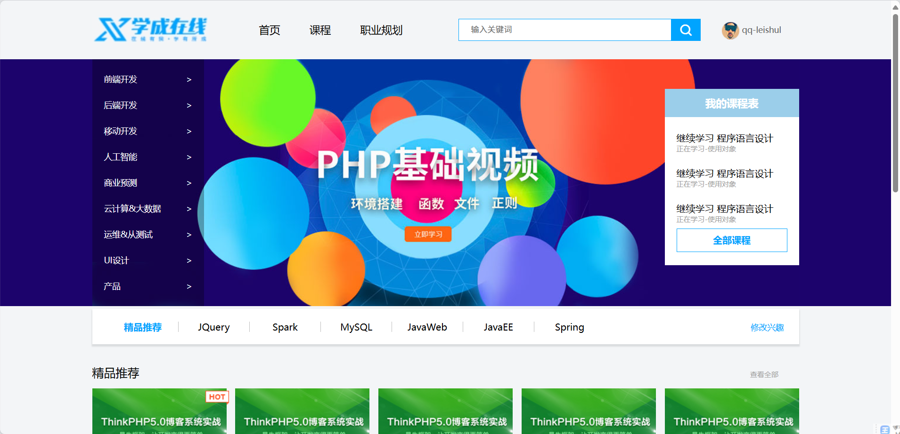
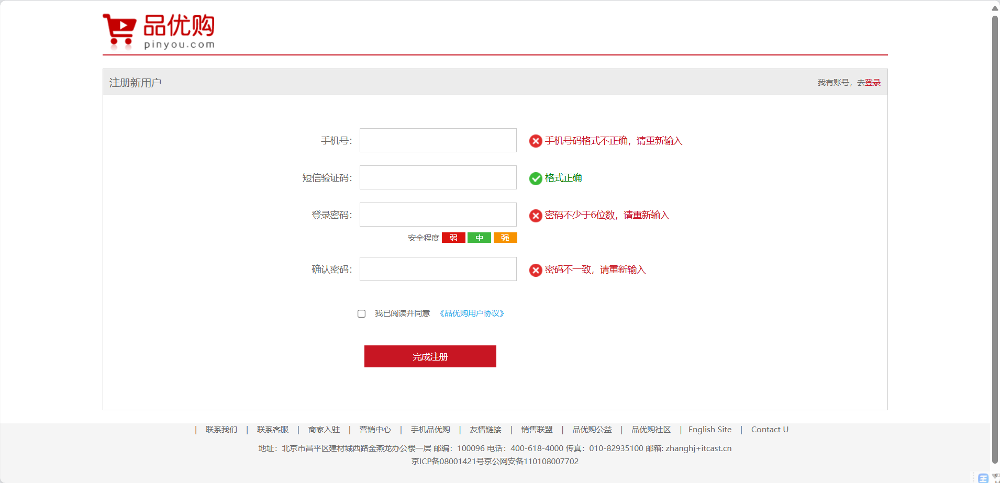
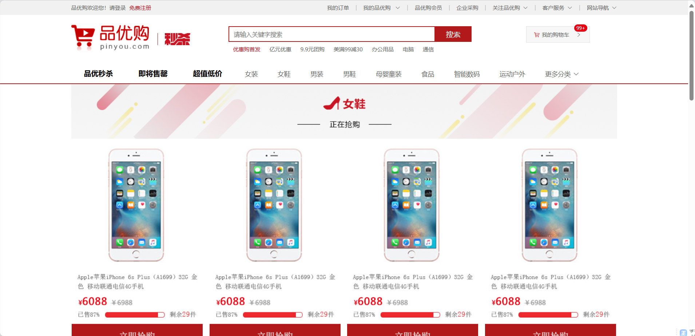
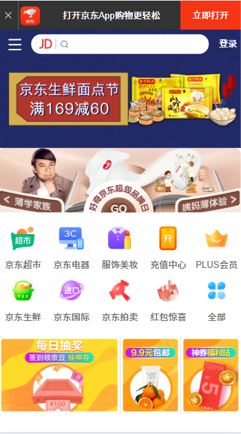
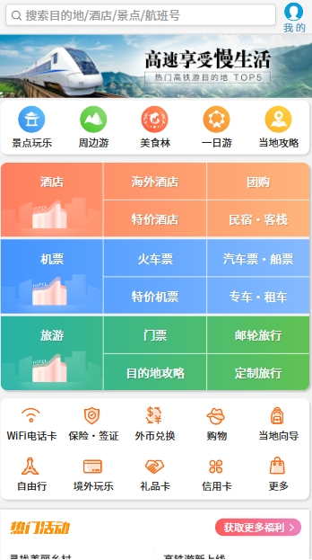

# HTML/CSS Programs(持续更新中...)
这个存储库中存放着我做过的网页项目，还有一些比较有意思的实现效果案例。

## 一、电脑端网页制作
1. 学成在线网页制作（仅有首页） 2025-2-27
   - 链接：[https://hongchen2.github.io/html-css-programs/学成网设计/index.html](https://hongchen2.github.io/html-css-programs/%E5%AD%A6%E6%88%90%E7%BD%91%E8%AE%BE%E8%AE%A1/index.html)
 

2. 品优购网页制作（包括首页，注册页，手机列表页三个页面） 2025-3-6
   - 首页链接：[https://hongchen2.github.io/html-css-programs/品优购项目/shopping/index.html](https://hongchen2.github.io/html-css-programs/品优购项目/shopping/index.html)
     
   - 注册页链接：[https://hongchen2.github.io/html-css-programs/品优购项目/shopping/register.html](https://hongchen2.github.io/html-css-programs/品优购项目/shopping/register.html)
     
   - 列表页链接：[https://hongchen2.github.io/html-css-programs/品优购项目/shopping/list.html](https://hongchen2.github.io/html-css-programs/品优购项目/shopping/list.html)
     
## 二、移动端网页制作
1. 京东移动端首页制作（仅包含部分首页元素） 2025-3-11
   - 链接：[https://hongchen2.github.io/html-css-programs/京东移动端首页/index.html](https://hongchen2.github.io/html-css-programs/京东移动端首页/index.html)
     
   
   
2. 携程网移动端首页制作 2025-3-13
   -  链接：[https://hongchen2.github.io/html-css-programs/携程网移动端首页/index.html](https://hongchen2.github.io/html-css-programs/携程网移动端首页/index.html)
      

## 三、有趣的案例
1. 旋转魔方（学习3D变换和动画后，制作而出） 2025-3-6
   - 链接：[https://hongchen2.github.io/html-css-programs/有趣的案例/3D旋转-魔方.html](https://hongchen2.github.io/html-css-programs/有趣的案例/3D旋转-魔方.html)
